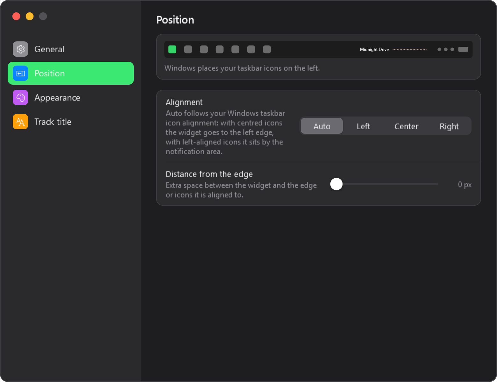
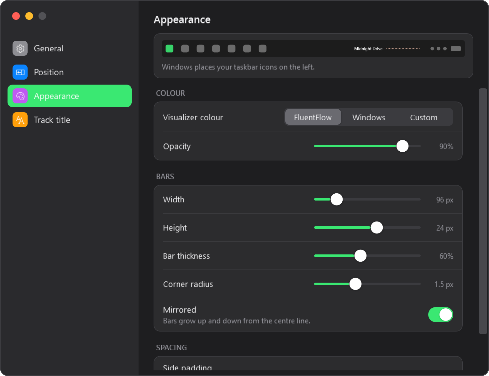
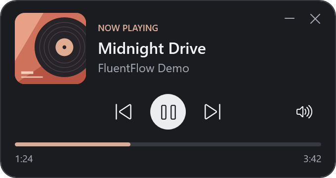
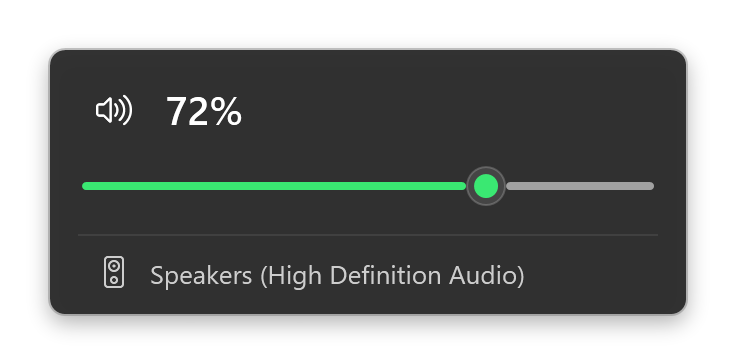
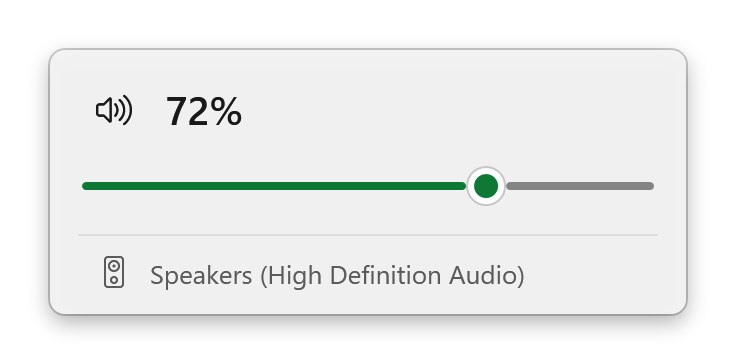

# FluentFlow

A small Windows media controller with a live audio visualizer that sits on the taskbar. It shows whatever
Windows is playing (Spotify, a browser tab, a media player, anything that talks to the system media controls),
lets you control it, and gives you a Windows 11 style volume flyout.

Inspired by [FluentFlyout](https://github.com/unchihugo/FluentFlyout).

## Screenshots

The widget on the taskbar: the track title and the visualizer (rendered from the app with a sample title):


The settings window, in the style of macOS System Settings, with a live preview of the widget on a mock taskbar:

<p>
  
  
</p>

The player window and the volume flyout (sample data):

<p>
  
</p>
<p>
  
  
</p>

## Features

- **Taskbar widget.** The current track title and a mirrored spectrum visualizer on the taskbar. Click it to open the
  player; right-click for *Open*, *Settings*, *Start with Windows* and *Exit*.
- **Settings.** Everything below changes the widget live and is remembered between runs.
  - *Position:* Auto, Left, Center or Right, plus a distance from the edge. **Auto follows your Windows taskbar icon
    alignment**: with centred icons the free space is at the edge, so the widget goes there; with left-aligned
    icons it sits next to the notification area. The widget always takes a free gap and never covers an icon.
  - *Appearance:* colour (FluentFlow, Windows accent or any custom colour), opacity, width, height, bar thickness,
    corner radius, mirrored or not, side padding.
  - *Track title:* show or hide it, add the artist, maximum width and text size.
- **Compact player window.** Cover art, title, artist, previous / play-pause / next, progress. It opens next to the
  widget and hides again with the widget, the close button or a second click.
- **Volume flyout.** Click the speaker icon: real system volume and mute, mouse wheel (2% per notch), keyboard
  (arrows, Esc) and the name of the current output device. Follows the Windows light/dark theme and accent colour.
- **Start with Windows.** A per-user entry (`HKCU\...\Run`), no elevation. Respects Task Manager's *Startup apps* switch.
- **Fallback.** If the taskbar can't host the widget, the player is shown as an ordinary window instead.

## Download

Grab `FluentFlow-win-x64.zip` from the [Releases](../../releases) page, unzip it and run `FluentFlow.exe`.
It needs the [.NET 10 Desktop Runtime](https://dotnet.microsoft.com/download/dotnet/10.0).

## Requirements

- Windows 10 version 2004 or later (the taskbar widget is designed for the Windows 11 taskbar)
- [.NET 10 SDK](https://dotnet.microsoft.com/download) to build, the .NET 10 Desktop Runtime to run

## Build and run

```powershell
dotnet build FluentFlow.slnx
dotnet run --project FluentFlow
```

Or open `FluentFlow.slnx` in Visual Studio and press F5.

Publish a framework-dependent build:

```powershell
dotnet publish FluentFlow/FluentFlow.csproj -c Release -r win-x64 --self-contained false -o publish
```

## Command line

| Argument | Effect |
| --- | --- |
| `--no-widget` | Don't use the taskbar; run as an ordinary window. |
| `--autostart` | Set by the *Start with Windows* entry. Waits up to a minute for the taskbar before falling back to a window. |
| `--theme light` / `--theme dark` | Pin the flyout theme instead of following Windows (for testing). |
| `--profile name` | Use a separate settings file and a separate "already running" lock, for side-by-side copies and tests. |

Only one copy runs at a time; starting a second one brings up the player of the first.

## How the taskbar widget works

The widget is a small WPF window that is re-parented to the taskbar (`Shell_TrayWnd`). That is the only way to put
your own pixels on the Windows 11 taskbar, and it comes with caveats.

Placement works on the free space of the taskbar: the notification area and every taskbar button (read through UI
Automation) are blocked out, and the widget takes the free gap that matches your alignment choice. *Auto* reads the
Windows *Taskbar alignment* setting to decide. Because it only ever uses free gaps, it adapts to centred or
left-aligned icons, crowded taskbars and right-to-left layouts alike.

- It is positioned from the taskbar's real geometry and re-checked every second, so it follows DPI, resolution,
  taskbar size and auto-hide changes. After an Explorer restart it is rebuilt.
- UI Automation is only used on a background thread. If the gap is narrower than the widget, the track title shrinks
  first; when there is no room at all the app switches to a normal window.
- Vertical taskbars and taskbars thinner than about 24 px are not supported (normal window instead).
- The widget is shown on the primary taskbar only.
- A child window shares input with the taskbar, so FluentFlow keeps its UI thread free of blocking work.

The placement maths is pure geometry and covered by unit tests, including every alignment, other taskbar edges,
DPI scales, secondary monitors, small buttons, crowded taskbars and right-to-left layouts.

## Settings file

Settings are saved as JSON in `%APPDATA%\FluentFlow\settings.json` a moment after each change. Values are checked
when they are read, so a hand-edited or damaged file falls back to defaults and can never break the widget.

## Tests

```powershell
dotnet test FluentFlow.slnx
```

## Project layout

| Path | Contents |
| --- | --- |
| `FluentFlow/Controls` | Visualizer, taskbar widget (view, window, host, docking maths), volume flyout, popup helper |
| `FluentFlow/Services` | Media session, audio capture and FFT, system volume, theme, settings, startup registration |
| `FluentFlow/SettingsWindow.xaml` | The macOS-style settings window |
| `FluentFlow/Resources` | Styles: Windows 11 flyout and menu, macOS-style settings |
| `FluentFlow.Tests` | Unit tests for the geometry and the settings |

## License

[MIT](LICENSE)

## Privacy

System audio is captured with WASAPI loopback only to draw the visualizer. It is analysed in memory and never
stored or sent anywhere.
